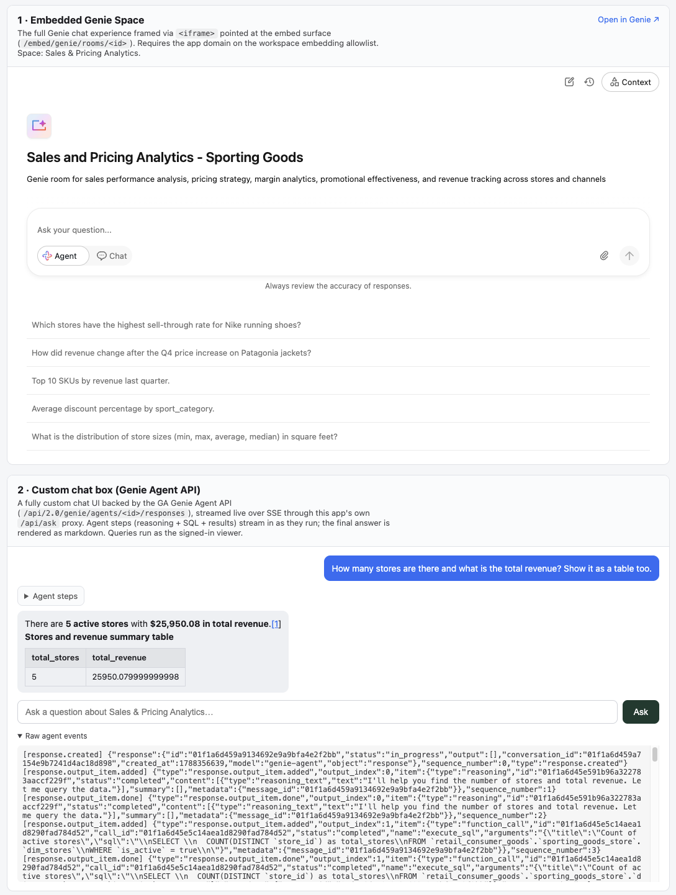

# Genie Embed App

A demonstration Databricks App showing **two ways to surface the "Ask Genie" chat
experience** inside a custom app — one clearly-labeled section each — deployed as a
Databricks Asset Bundle (DAB) using the **`direct`** deployment engine.



| # | Section | Mechanism | Auth |
|---|---|---|---|
| 1 | **Embedded Genie Space** | `<iframe>` → `/embed/genie/rooms/<id>` (the full Genie chat page) | Viewer's browser session |
| 2 | **Custom chat box (Genie Agent API)** | Self-styled UI → this app's `POST /api/ask` → GA Genie **Agent API** (`/api/2.0/genie/agents/<id>/responses`), streamed over SSE | On-behalf-of viewer (OBO) |

Both use **one** Genie space (its id is both the iframe room id and the Agent API
`agent_id` — the two are synonymous). Section 1 is pure HTML with no auth. Section 2
adds the only server-side logic: it reads the viewer's forwarded OAuth token and
streams the Agent API response back to the browser.

> **Why not embed an AI/BI dashboard's "Ask Genie"?** AI/BI dashboards have no
> standalone Genie chat-box widget — "Ask Genie" only appears *inside* a whole
> embedded dashboard (with its visualizations). To get *just* a chat box, use the
> Genie Agent API with a custom UI (section 2).

---

## Prerequisites

| # | Requirement | How to check / get it |
|---|---|---|
| 1 | **Databricks CLI ≥ 1.3.0** | `databricks --version` |
| 2 | **A CLI profile for the target workspace** | `databricks auth describe -p <profile>` |
| 3 | **Workspace admin** (once) | To add the app domain to the embedding allowlist (Step 3), needed for **section 1's iframe**. Section 2 does not need it. |
| 4 | **A Genie space** you can access, plus its **space ID** | `databricks genie list-spaces -p <profile>` |
| 5 | **Viewers have access** to the space + its underlying data | Both sections run as the viewer (or, section 2 locally, as the app SP). Grant via the space's **Share** dialog. |

List space IDs, e.g.:

```bash
databricks genie list-spaces -p <profile> \
  | python3 -c "import sys,json;[print(s['space_id'],'—',s['title']) for s in json.load(sys.stdin)['spaces']]"
```

---

## Project layout

```
genie-embed-app/
  databricks.yml        # bundle (engine: direct) + variables + app resource (command + env)
  src/
    app.py              # FastAPI: two Genie sections + streaming /api/ask proxy
    requirements.txt    # fastapi, uvicorn[standard], httpx, databricks-sdk
```

There is no `app.yaml` — the app's run command and environment are defined in the
bundle's app-resource `config` block, so all settings live in one file.

---

## Step 1 — Configure the Genie space (bundle variables)

Every setting is a **bundle variable** in `databricks.yml`. Change the defaults
there, or override per deploy without editing any file:

```bash
databricks bundle deploy -t dev -p <profile> \
  --var="genie_space_id=<space-id>" \
  --var="genie_space_title=My Space"
```

| Variable | Meaning |
|---|---|
| `workspace_host` | Workspace host serving the Genie embed surface (no trailing slash) |
| `workspace_id` | Workspace (org) id appended as the `?o=` URL param |
| `genie_space_id` | Genie space id — iframe room (§1) **and** Agent API `agent_id` (§2) |
| `genie_space_title` | Heading/label shown for the space |

---

## Step 2 — Deploy the app

```bash
databricks bundle validate --strict -t dev -p <profile>   # config sanity check
databricks bundle deploy   -t dev -p <profile>            # creates the app (direct engine)
databricks bundle run genie_embed -t dev -p <profile>     # starts the app, prints its URL
```

`bundle run` also restarts the app after a redeploy. Check status / logs any time:

```bash
databricks apps get  genie-embed-dev -p <profile>     # app_status / compute_status
databricks apps logs genie-embed-dev -p <profile>     # build + runtime logs
```

---

## Step 3 — Allow inline embedding (workspace admin, one-time) — section 1 only

The app runs on `*.databricksapps.com` while Genie lives on `*.cloud.databricks.com`
(a different origin). Databricks only lets a Genie room be framed on domains in the
workspace's **embedding approved-domains allowlist**. Until the app's domain is
allowlisted, the browser blocks the frame (CSP `frame-ancestors`) and **section 1**
is blank — use its "Open in Genie ↗" link. **Section 2 is unaffected** (it's a
same-origin backend call, not a frame).

**3a. Check the current policy:**

```bash
databricks settings aibi-dashboard-embedding-access-policy    get -p <profile>
databricks settings aibi-dashboard-embedding-approved-domains get -p <profile>
```

The access policy must be `ALLOW_APPROVED_DOMAINS` (or `ALLOW_ALL_DOMAINS`), and the
app domain must be in the approved-domains list. **An empty list blocks everything.**

**3b. Add the app domain — UI:** username → **Settings** → **Security** →
**External access** → **Embed dashboards** → **Manage** → add
`*.databricksapps.com` → **Save**.

**3b. Add the app domain — CLI** (fails unless the policy is already
`ALLOW_APPROVED_DOMAINS`):

```bash
ETAG=$(databricks settings aibi-dashboard-embedding-approved-domains get -p <profile> \
  | python3 -c "import sys,json;print(json.load(sys.stdin)['etag'])")

databricks settings aibi-dashboard-embedding-approved-domains update -p <profile> --json "{
  \"allow_missing\": true,
  \"setting\": {
    \"aibi_dashboard_embedding_approved_domains\": {\"approved_domains\": [\"*.databricksapps.com\"]},
    \"etag\": \"$ETAG\",
    \"setting_name\": \"default\"
  },
  \"field_mask\": \"aibi_dashboard_embedding_approved_domains.approved_domains\"
}"
```

If the policy is `DENY_ALL_DOMAINS`, first switch it to `ALLOW_APPROVED_DOMAINS`
(the same `settings aibi-dashboard-embedding-access-policy update` pattern with an
`etag` from a `get`).

---

## How section 2 works (Genie Agent API + OBO streaming)

The custom chat box (`src/app.py`) posts each question to the app's own endpoint,
which proxies to the GA Genie **Agent API** and streams the SSE response back:

```
browser  --POST /api/ask {question}-->  app  --POST /api/2.0/genie/agents/<id>/responses-->  Genie
         <----- text/event-stream ------      <---------- text/event-stream --------------
```

**Auth (OBO, with SP fallback):** Databricks Apps forward the signed-in viewer's
OAuth token in the `X-Forwarded-Access-Token` header. The app uses it as the bearer
token so Genie answers **as the viewer**, respecting their space/data access — the
same identity model as the section-1 iframe. When the header is absent (local
`uvicorn`), it falls back to the app service principal via the Databricks SDK:

```python
token = request.headers.get("X-Forwarded-Access-Token")   # OBO (deployed app)
# else: databricks.sdk.core.Config().authenticate()       # SP fallback (local dev)
```

> **User API scopes (required).** For OBO to reach the Agent API, the app must
> request the `genie` scope (and `sql` for the queries Genie runs). This bundle sets
> them on the app resource:
>
> ```yaml
> user_api_scopes:
>   - genie
>   - sql
> ```
>
> Without `genie`, the forwarded token returns
> `403 Provided OAuth token does not have required scopes: genie` even though
> section 1's iframe renders fine. **Changing the scopes only takes effect for a
> viewer after they re-authenticate** (a fresh login / new session) so the token is
> re-minted with the wider scopes.

**Request body** sent to the Agent API (`stream: true` for live SSE):

```json
{"input": [{"type": "message", "role": "user",
            "content": [{"type": "input_text", "text": "<question>"}]}],
 "stream": true,
 "enable_viz": true}
```

**Streaming granularity & markdown.** The GA Agent API streams at *item* granularity
(not raw tokens): each server-sent event carries a complete output item — a
`reasoning` step, an `execute_sql` `function_call`, a `function_call_output` result
table, or the final assistant `message` (`output_text`). The app forwards the SSE
frames verbatim; the browser renders each item live in an **"Agent steps"** trace as
it arrives (SQL in a code block, result sets as tables), then typewriter-reveals the
final `message` and renders it as **markdown** (bold, tables, links) via a small
self-contained renderer — no CDN dependency. A **"Raw agent events"** panel under the
chat box shows every event for debugging.

**Binding the port** — Databricks Apps inject `DATABRICKS_APP_PORT`; never hardcode
`8080` or you get 502s:

```python
if __name__ == "__main__":
    port = int(os.environ.get("DATABRICKS_APP_PORT", "8000"))
    uvicorn.run(app, host="0.0.0.0", port=port)
```

---

## Local development

```bash
cd src
pip install -r requirements.txt
DATABRICKS_WORKSPACE_HOST=https://<host> \
WORKSPACE_ID=<org-id> \
GENIE_SPACE_ID=<space-id> \
GENIE_SPACE_TITLE="My Space" \
python app.py   # serves on :8000
```

Locally there's no forwarded token, so section 2 authenticates as the service
principal / user behind your CLI profile (via the SDK). Section 1's iframe won't
render off the allowlisted `*.databricksapps.com` domain — use its "Open in Genie"
link. Smoke-test the proxy directly:

```bash
curl -N -X POST http://localhost:8000/api/ask \
  -H "Content-Type: application/json" \
  -d '{"question":"What can you tell me about this data?"}'   # -N shows SSE frames streaming
```
